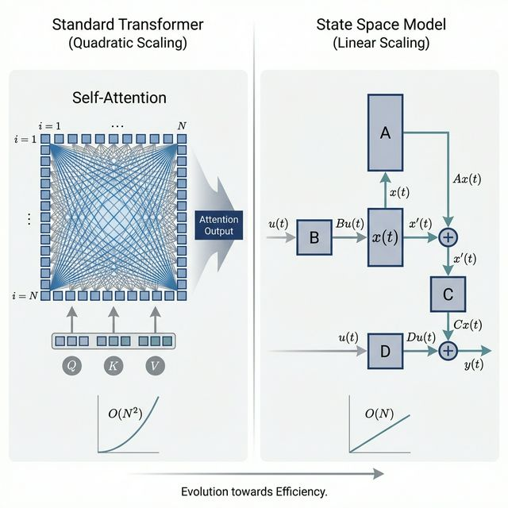
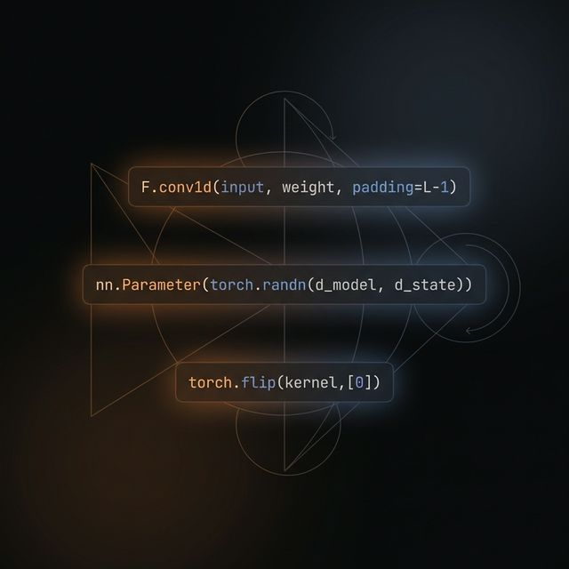

# Deconstructing State Space Models (Mamba) 🐍

*A "Build in Public" mini-series breaking down State Space Models (SSMs) and Mamba.*



## Overview

Transformers have a fatal flaw: the Attention mechanism scales quadratically. This repository is part of a "Build in Public" mini-series completely deconstructing State Space Models (SSMs). 

SSMs compress the sequence context into a hidden "state" that updates linearly as new data flows in—providing fast inference, linear scaling, and infinite context potential.

### Series Outline
1. **Part 1**: The fundamental math (Control Theory 101 for AI)
2. **Part 2**: Writing a 1D State Space layer in under 100 lines of pure PyTorch
   
3. **Part 3**: Scaling to a multi-channel Mamba Block and benchmarking vs Transformers
   

## Code Structure

### `simple_ssm.py` (Part 2)
A minimal, educational 1-Dimensional Linear Time-Invariant (LTI) State Space Model layer in pure PyTorch.

**Features:**
- Continuous-time parameters mapped to discrete transitions via Zero-Order Hold (ZOH).
- **Fast Convolutional Training**: O(L) path using PyTorch convolutions for sequence training.
- **O(1) Memory Recurrence**: Autoregressive generation path for deployment.
- Strict validation that both paths yield mathematically identical results.

### `mamba_block_benchmark.py` (Part 3)
A full implementation wrapping `Simple1DSSM` into a modern Mamba block, paired with an empirical accuracy benchmark against a standard PyTorch Transformer.

**Features:**
- Full `MambaBlock` with input projections, independent D_inner sequence channels, and parallel sigmoid gating.
- Synthetic Selective Copying task evaluating long-range memory routing.
- Step-by-step benchmark script profiling accuracy degradation across sequence lengths ($L=256 \to 2048$).

## Quick Start

You can run the minimal SSM implementation directly to verify mathematical LTI duality:

```bash
python simple_ssm.py
```

Or run the empirical accuracy benchmark comparing Mamba vs. a baseline Transformer:

```bash
python mamba_block_benchmark.py
```

## Articles and Posts
The detailed write-ups for the series are available online:

**Part 1: The Intuition and Mathematics**
- 🔗 [Read the Full Blog Post](https://soveshmohapatra.com/projects/mamba-ssm-theory/)
- 🔗 [Join the Discussion on LinkedIn](https://www.linkedin.com/feed/update/urn:li:activity:7431122409711374336/?originTrackingId=wQPcaqKdn4pVi9A7h0mXGg%3D%3D)

**Part 2: Pure PyTorch Implementation**
- 🔗 [Read the Full Blog Post](https://soveshmohapatra.com/projects/mamba-ssm-live-code/)
- 🔗 [Join the Discussion on LinkedIn](https://www.linkedin.com/feed/update/urn:li:activity:7431498487692713984/?originTrackingId=FA1vwkjcBX3jfEk9C%2Bq9aw%3D%3D)

**Part 3: Scaling to Mamba and Transformers**
- 🔗 [Read the Full Blog Post](https://soveshmohapatra.com/projects/mamba-ssm-live-code/)
- 🔗 [Join the Discussion on LinkedIn](https://www.linkedin.com/in/sovesh)

Check out my [LinkedIn](https://www.linkedin.com/in/sovesh) to follow along with the live updates for future parts!
